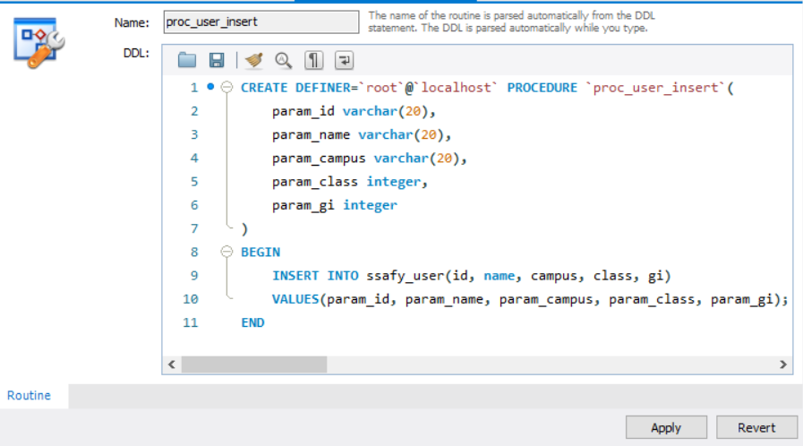

#### Stored Procedure

스토어드 프로시저(Stored Procedure, 저장 프로시저)는 MySQL이 제공하는 프로그래밍 기능으로 데이터베이스 내부에 저장됨. 주로 어떠한 동작들을 모아 모듈화 시켜서 필요할 때마다 호출만 하는 것으로 편리하게 MySQL을 운영할 수 있도록 함

 <br/>

#### 형식

```mysql
DELIMITER $$
CREATE PROCEDURE 스토어드프로시저명(IN|OUT 파라미터)
BEGIN
	-- SQL 프로그래밍 코딩 부분..
END $$
DELIMITER ;

-- CALL 스토어드프로시저명();로 호출
```

DELIMITER $$ ~ END $$ : 스토어드 프로시저의 범위 명시

CREATE PROCUDURE : 프로시저의 이름과 파라미터 선언

BEGIN ~ END : 수행할 쿼리와 로직 작성

 <br/>

```mysql
CREATE PROCEDURE `proc_user_insert` (
	param_id varchar(20),
    param_name varchar(20),
    param_campus varchar(20),
    param_class integer,
    param_gi integer
)
BEGIN
	INSERT INTO ssafy_user(id, name, campus, class, gi)
    VALUES(param_id, param_name, param_campus, param_class, param_gi);
END
```

```mysql
CALL proc_user_insert('ssafy', '문유주', '광주', 1, 7);

SELECT * FROM ssafy_user
```

 <br/>

#### 저장 프로시저의 장점

1.  하나의 요청으로 여러 SQL문을 실행 할 수 있음
2.  네트워크 소요 시간을 줄일 수 있음
3.  개발 업무를 구분해 개발 할 수 있음
4.  유지관리 용이
5.  보안 강화

 <br/>

#### 저장 프로시저의 단점

1. 처리 성능이 낮음
2. 디버깅 어려움
3. DB 확장 힘듦

 <br/>

#### 실습





<br/>
