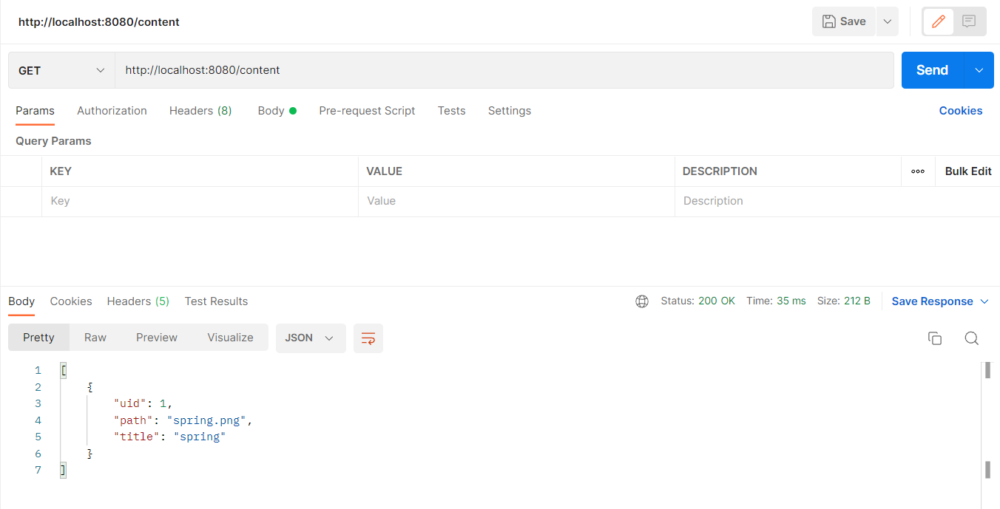
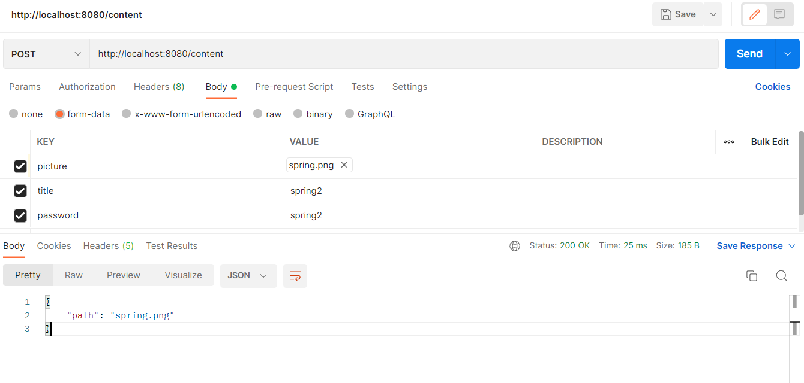
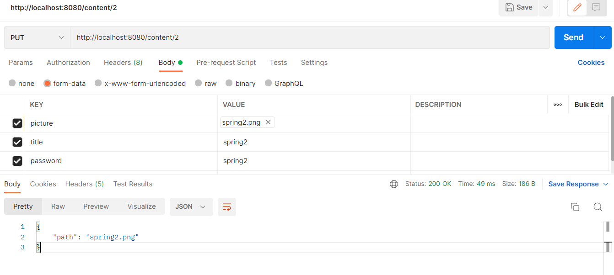
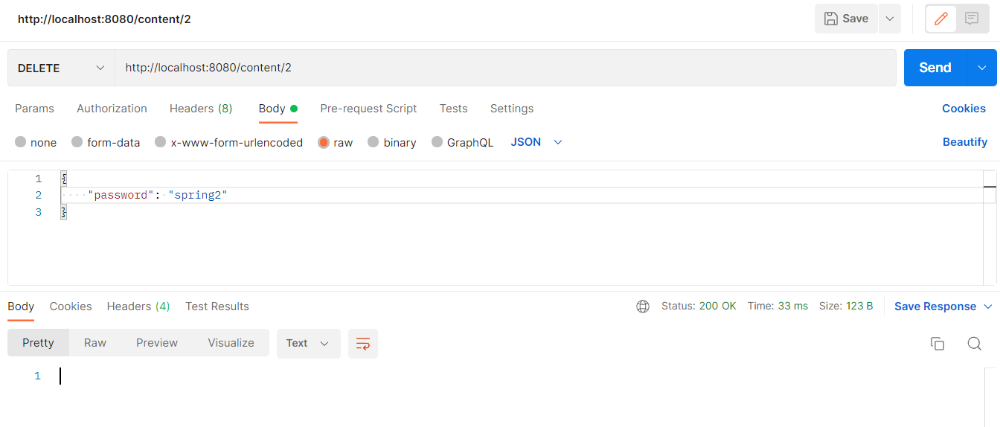
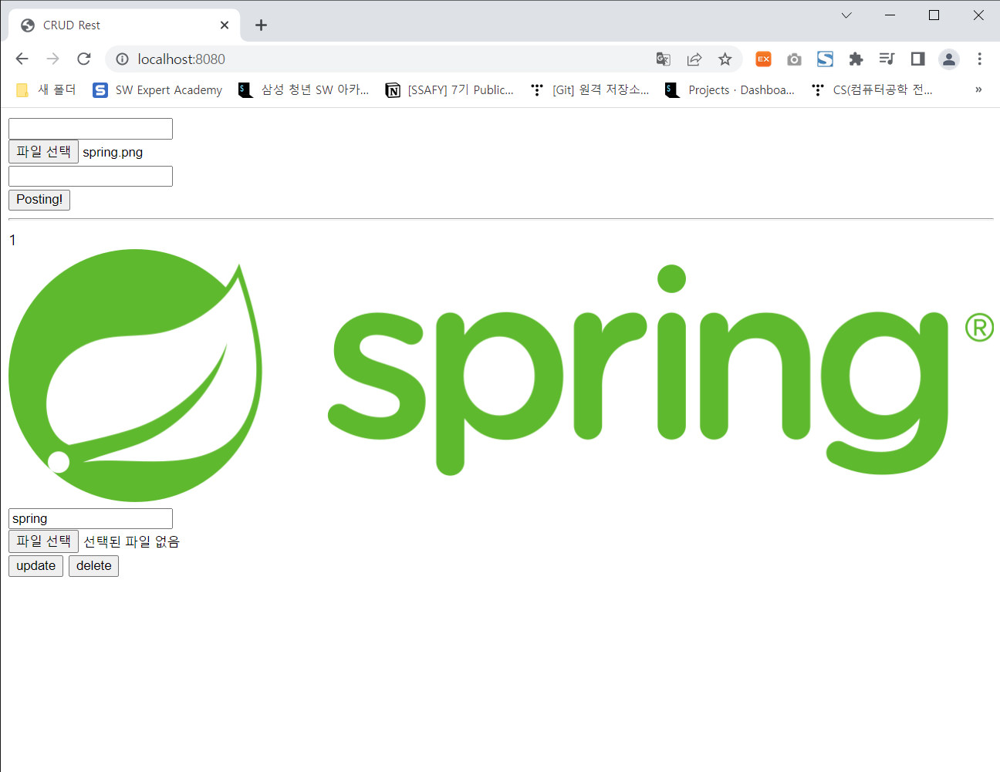

## 파일 업로드 CRUD

<br/>

### API설계

| 기능           | METHOD | 리소스   | PATH   | Input Data                                             | Input Data Type | Output Data                                             | Output Data Type |
| :------------- | ------ | -------- | ------ | ------------------------------------------------------ | --------------- | ------------------------------------------------------- | ---------------- |
| 사진 목록 조회 | GET    | /content |        |                                                        |                 | [{uid: String<br />path: String<br />contents: String}] | json list        |
| 사진 목록 작성 | POST   | /content |        | picture: file<br />title: String<br />password: String | multipart/form  | {path: String}                                          | json             |
| 사진 목록 수정 | PUT    | /content | /{uid} | picture: file<br />title: String<br />password: String | multipart/form  | {path: String}                                          | json             |
| 사진 목록 삭제 | DELETE | /content | /{uid} | password: String                                       | json            |                                                         | void             |









<br/>

### 구현

#### Entity

```java
package com.example.crudrest.entity;


import lombok.*;

import javax.persistence.Entity;
import javax.persistence.GeneratedValue;
import javax.persistence.GenerationType;
import javax.persistence.Id;

@Entity
@NoArgsConstructor
@Getter
@Setter
@ToString
public class Content {

    @Id
    @GeneratedValue(strategy = GenerationType.IDENTITY)
    private int uid;
    private String path;
    private String title;
    private String password;

    @Builder
    public Content(String path, String title, String password){
        super();
        this.path = path;
        this.title = title;
        this.password = password;
    }
}
```

#### Repository

```java
package com.example.crudrest.repository;

import com.example.crudrest.entity.Content;
import org.springframework.data.jpa.repository.JpaRepository;

import java.util.List;

public interface ContentRepository extends JpaRepository<Content, Integer> {

    public List<Content> findTop1000ByOrderByUidDesc();
}
```

#### controller

```java
package com.example.crudrest.controller;


import com.example.crudrest.entity.Content;
import com.example.crudrest.repository.ContentRepository;
import lombok.AllArgsConstructor;
import org.springframework.web.bind.annotation.*;
import org.springframework.web.multipart.MultipartFile;

import java.io.File;
import java.io.IOException;
import java.util.*;

@RestController
@AllArgsConstructor
@RequestMapping("/content")
public class Restcontroller {

    ContentRepository contentRepository;

    @GetMapping
    public List<Map<String, Object>> list() {
        List<Map<String, Object>> result = new ArrayList<>();
        contentRepository.findTop1000ByOrderByUidDesc().forEach(contentList -> {
            Map<String, Object> obj = new HashMap<>();
            obj.put("uid", contentList.getUid());
            obj.put("path", contentList.getPath());
            obj.put("title", contentList.getTitle());
            result.add(obj);
        });
        return result;
    }

    @PostMapping
    public Map<String, String> post(@RequestPart("picture") MultipartFile pic,
                                    @RequestParam("title") String title,
                                    @RequestParam("password") String password) throws IOException {
        String path = System.getProperty("user.dir");
        // 파일생성
        File file = new File(path + "/src/main/resources/static/" + pic.getOriginalFilename());
        // 폴더가 없으면 새로 생성
        if(!file.getParentFile().exists()){
            file.getParentFile().mkdirs();
        }
        // 파일저장
        pic.transferTo(file);
        contentRepository.save(
                Content.builder()
                        .password(password)
                        .title(title)
                        .path(file.getName())
                        .build()).getUid();

        return Map.of("path",file.getName());
    }

    @PutMapping("/{uid}")
    public Map<String, String>update(@PathVariable int uid,
                                     @RequestPart("picture") MultipartFile pic,
                                     @RequestParam("title") String title,
                                     @RequestParam("password") String password) throws IOException{
        // uid 값으로 Repository 조회
        Optional<Content> content = contentRepository.findById(uid);
        // 조회된 객체의 비밀번호와 프론트 단에서 넘어온 비밀번호가 같으면 update 진행
        if (content.get().getPassword().equals(password)){
            if(!pic.isEmpty()){
                String path = System.getProperty("user.dir");
                String savepath = path + "/src/main/resources/static/" + pic.getOriginalFilename();
                File file = new File(savepath);
                if (!file.exists()){
                    pic.transferTo(file);
                    content.get().setPath(pic.getOriginalFilename());
                }
            }
            content.get().setTitle(title);
            contentRepository.save(content.get());
        }
        Map<String,String> result = new HashMap<>();
        result.put("path", pic.getOriginalFilename());
        return result;
    }

    @DeleteMapping("/{uid}")
    public void delete(@PathVariable int uid,
                       @RequestBody Map<String, Object> body){
        Optional<Content> content = contentRepository.findById(uid);
        if (content.get().getPassword().equals(body.get("password"))){
            contentRepository.delete(content.get());
        }
    }
}
```


<br/>

### View



<br/>