### REST

: Representational State Transfer

자원을 이름으로 구분하여 해당 자원의 상태를 주고 받는 모든 것을 의미

HTTP URI(Uniform Resource Identifier)를 통해 자원(Resource)을 명시하고, HTTP Method(POST, GET, PUT,

DELETE)를 통해 해당 자원에 대한 CRUD Operation을 적용하는 것을 의미

- 장점

​	HTTP 프로토콜의 인프라를 그대로 사용하므로 REST API를 위한 별도의 인프라를 구축할 필요 없음

​	HTTP 표준 프로토콜을 따르는 모든 플랫폼에서 사용 가능

​	메시지가 의도하는 바를 쉽게 파악할 수 있음

- 단점

​	HTTP Method 형태가 제한적임

<br/>

### 실습

```java
package com.example.quizapp;

import org.json.JSONObject;
import java.io.*;
import java.net.*;

public class RestAPI {
    static void restFunction(String nexturl, String answer) {
    	HttpURLConnection conn = null;
		JSONObject responseJson = null;
		 try {
		        //URL 설정
		        URL url = new URL("http://13.125.222.176" + "/quiz/" + nexturl);
		        conn = (HttpURLConnection) url.openConnection();
		        //Request 형식 설정
		        conn.setRequestMethod("POST");
		        conn.setRequestProperty("Content-Type", "application/json");
		        //request에 JSON data 준비
		        conn.setDoOutput(true);
		        BufferedWriter bw = new BufferedWriter(new OutputStreamWriter(conn.getOutputStream()));
		        //commands라는 JSONArray를 담을 JSONObject 생성
		        JSONObject commands = new JSONObject();
		        commands.put("nickname", "문유주");
		        commands.put("yourAnswer", answer);
		        //request에 쓰기
		        bw.write(commands.toString());
		        bw.flush();
		        bw.close();

		        //보내고 결과값 받기
		        int responseCode = conn.getResponseCode();
		        if (responseCode == 400) {
		            System.out.println("400:: 해당 명령을 실행할 수 없음 (실행할 수 없는 상태일 때, 엘리베이터 수와 Command 수가 일치하지 않을 때, 엘리베이터 정원을 초과하여 태울 때)");
		        } else if (responseCode == 401) {
		            System.out.println("401:: X-Auth-Token Header가 잘못됨");
		        } else if (responseCode == 500) {
		            System.out.println("500:: 서버 에러, 문의 필요");
		        } else { // 성공 후 응답 JSON 데이터받기
		            BufferedReader br = new BufferedReader(new InputStreamReader(conn.getInputStream()));
		            StringBuilder sb = new StringBuilder();
		            String line = "";
		            while ((line = br.readLine()) != null) {
		                sb.append(line);
		            }
		            responseJson = new JSONObject(sb.toString());
		        }
		    } catch (MalformedURLException e) {
		        e.printStackTrace();
		    } catch (IOException e) {
		        e.printStackTrace();
		    }
		   System.out.println(responseJson);
    }
}
```

- Json 코드가 200이면 정답, 600이면 오답, 403이면 닉네임 미기재

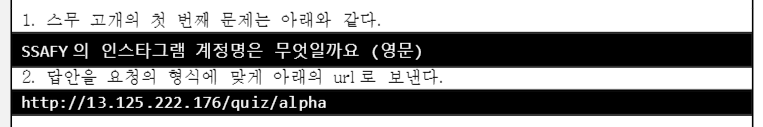


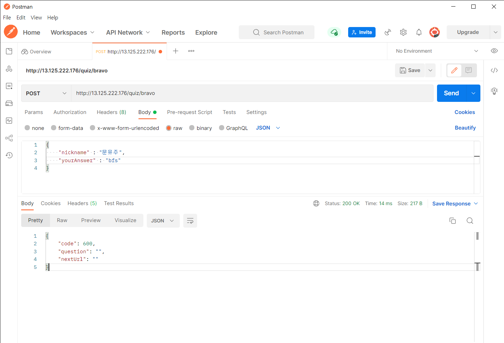


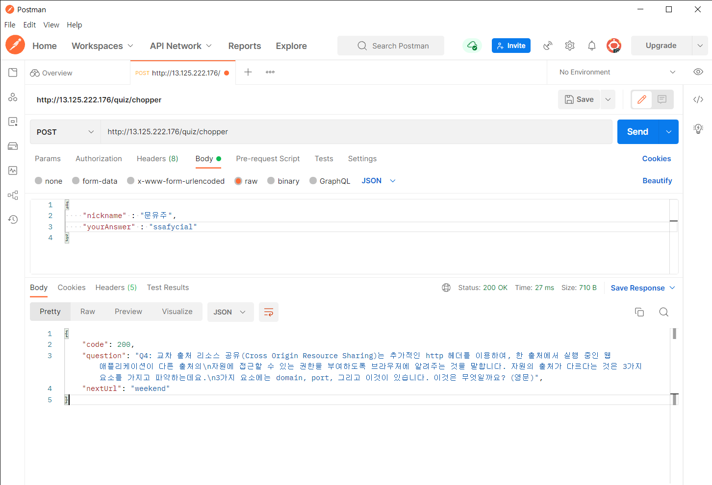

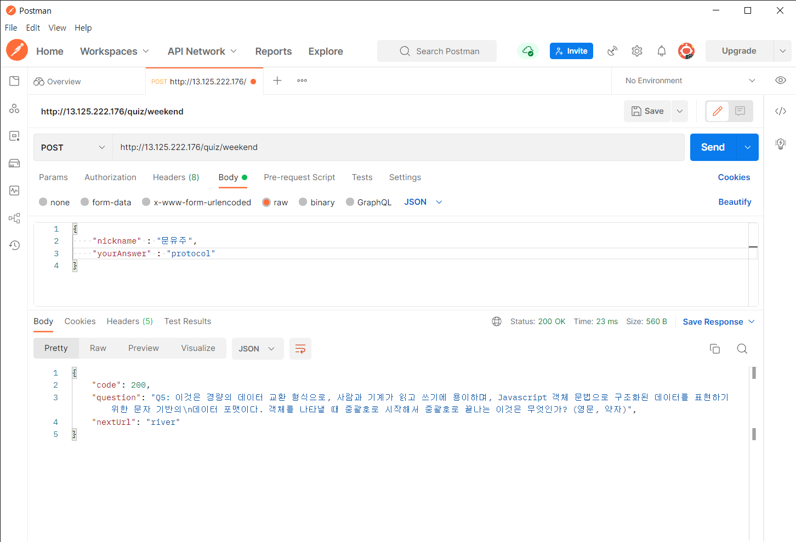


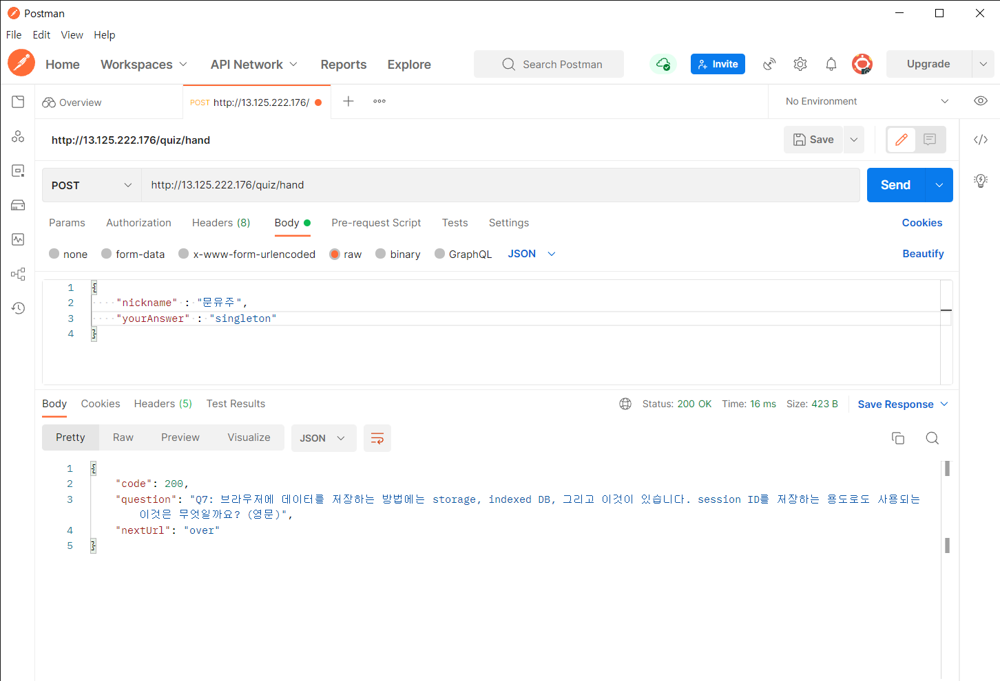


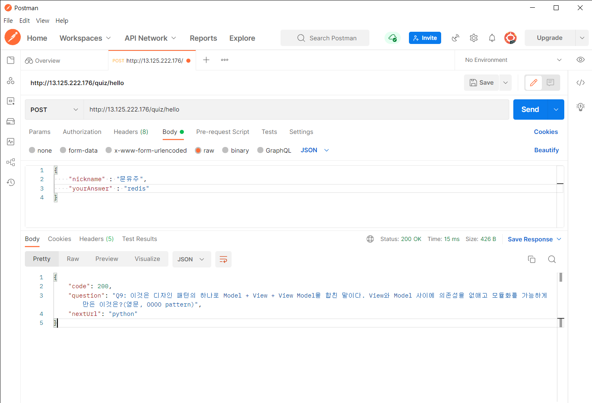

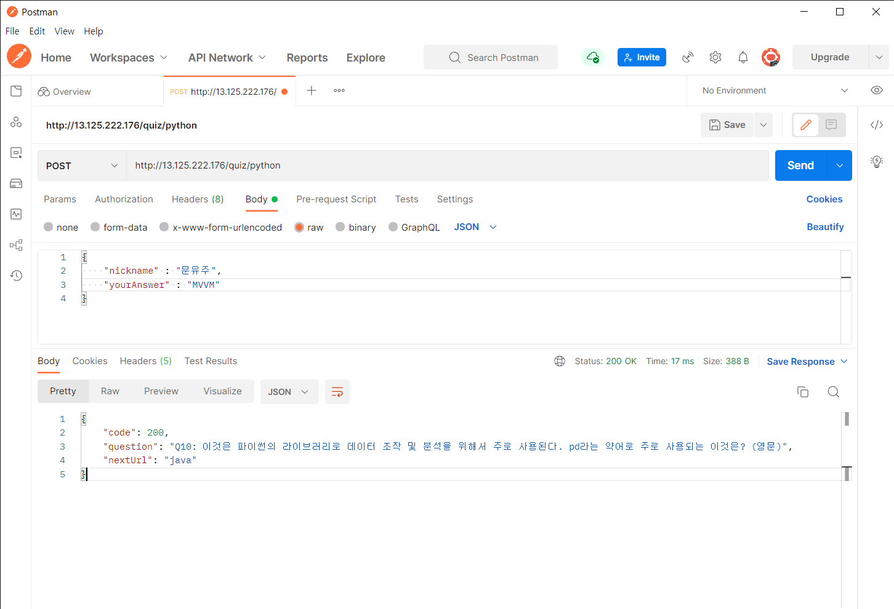

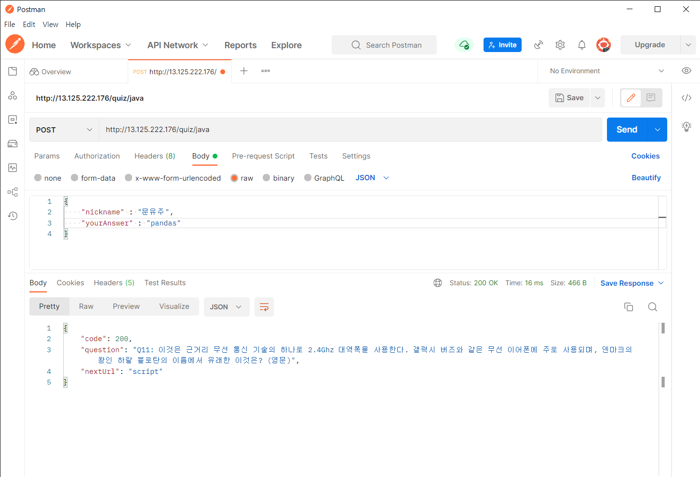


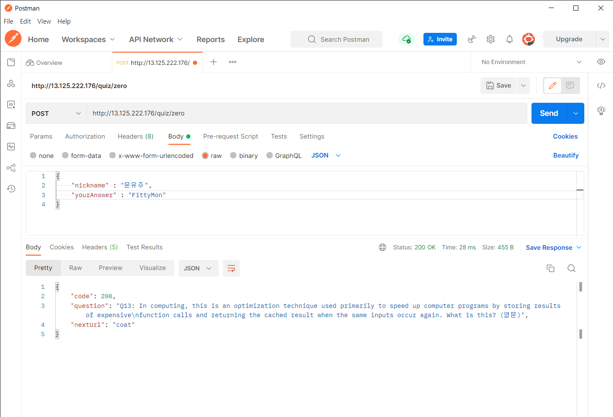

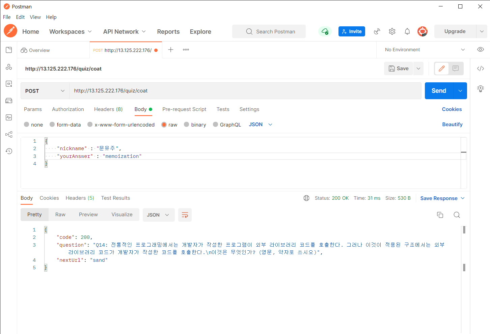


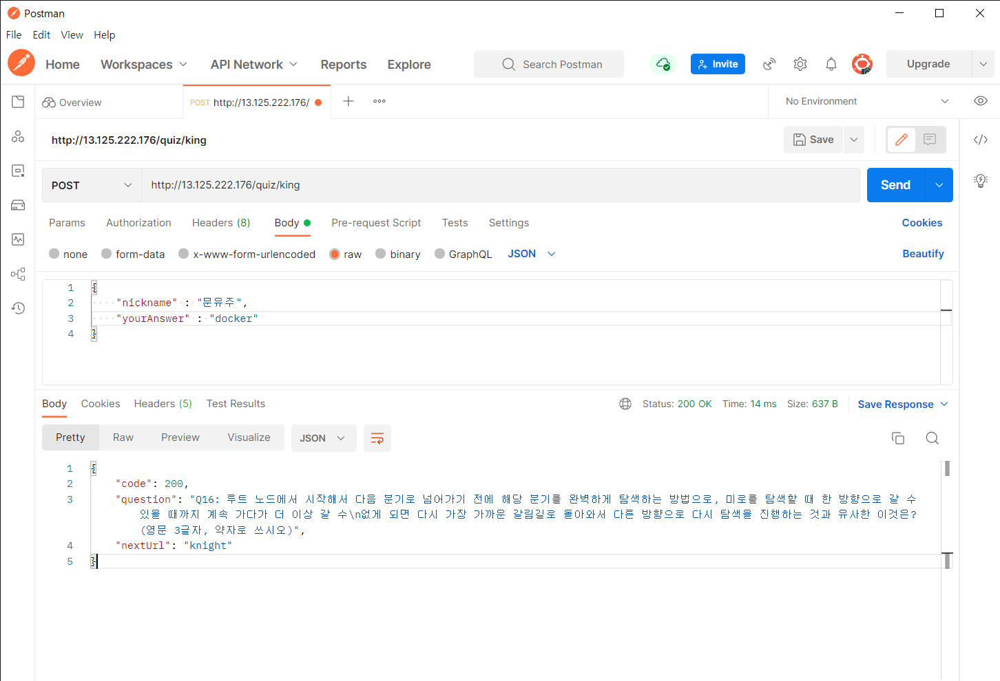

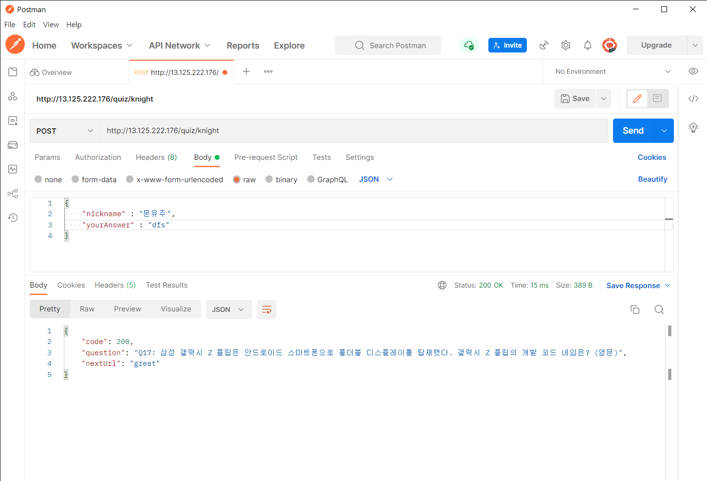

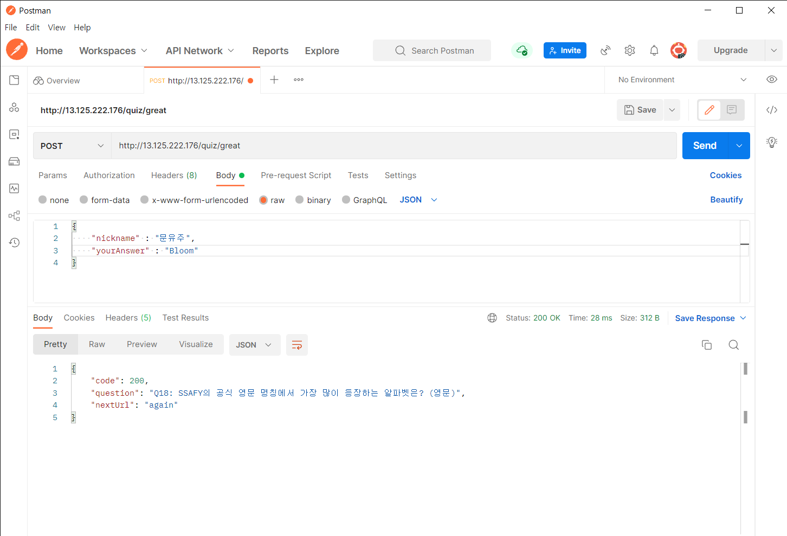

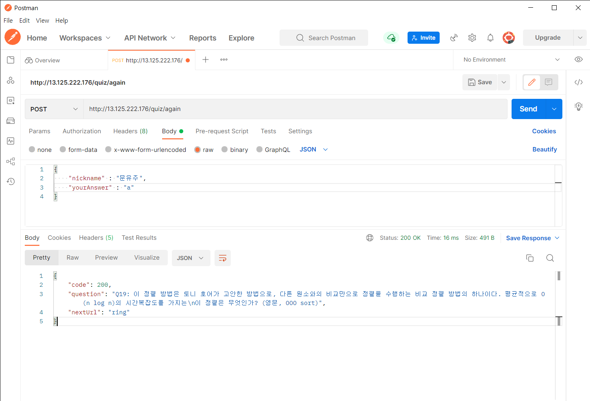


<br/>
